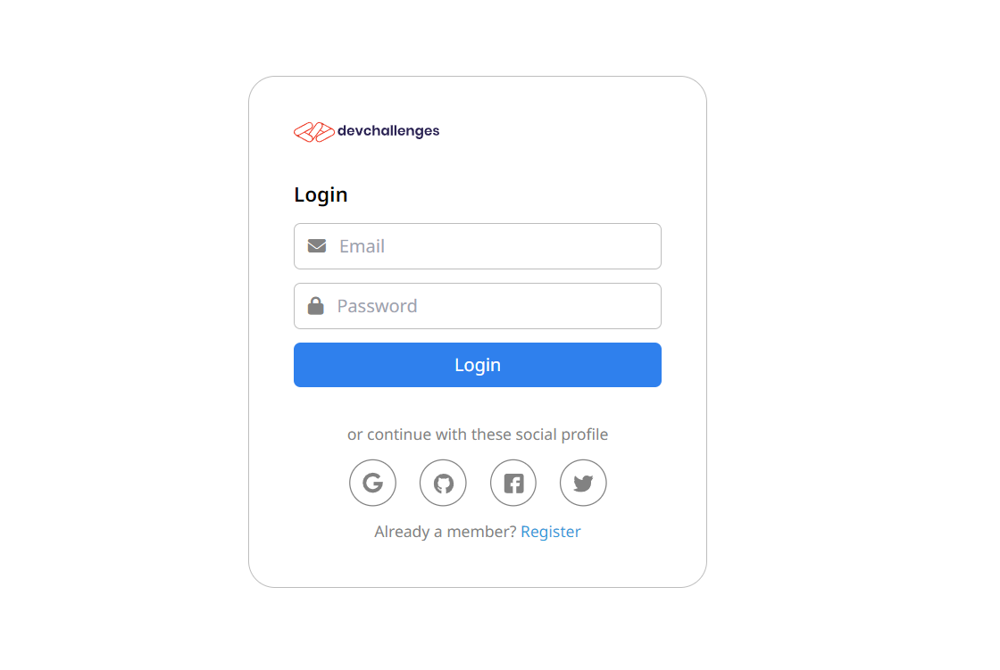

<h1 align="center">My Unsplash</h1>

   Solution for a challenge from  <a href="http://devchallenges.io" target="_blank">Devchallenges.io</a>.

  <h3>
    <a href="https://fullstack-auth.onrender.com" target="_blank">
      Demo
    </a>
     | 
    <a href="https://devchallenges.io/solutions/fP9B5ifAT12l5bgInktm" target="_blank">
      Solution
    </a>
     | 
    <a href="https://devchallenges.io/challenges/N1fvBjQfhlkctmwj1tnw" target="_blank">
      Challenge
    </a>
  </h3>

<!-- TABLE OF CONTENTS -->

## Table of Contents

- [Overview](#overview)
- [Built With](#built-with)
- [Features](#features)
- [Acknowledgements](#acknowledgements)

<!-- OVERVIEW -->

## Overview

### Built With

<!-- This section should list any major frameworks that you built your project using. Here are a few examples.-->

- **React**
- **Tailwind**
- **Express**

## Features

<!-- List the features of your application or follow the template. Don't share the figma file here :) -->

This application/site was created as a submission to a [DevChallenges](https://devchallenges.io/challenges) challenge. The [challenge](https://devchallenges.io/challenges/wBunSb7FPrIepJZAg0sY) was to build an application to complete the given user stories.

- User story: I can register a new account
- User story: I can log in
- User story: I can log in or register with at least one of the following services: Google, Facebook, Twitter or Github
- User story: I can sign out
- User story: I can see my profile details
- User story: I can edit my details including: photo, name, bio, phone, email and password
- User story: I can upload a new photo or provide an image URL

## Acknowledgements

- [Render](https://render.com) - For Frontend and Backend deployment
- [Cloudinary](https://cloudinary.com) - For image upload
